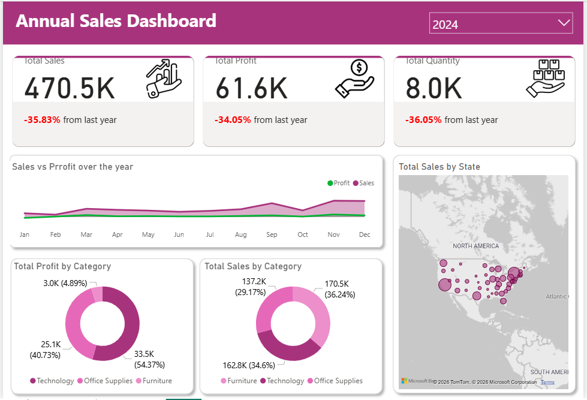

# Project Overview

This project contains a strategic financial Power BI dashboard built to analyze year-over-year (YoY) performance across multiple product categories and regions. The dashboard highlights the relationship between sales growth and profitability.

# 🚀 Key Features

YoY Performance Metrics: Track Sales, Profit, and Quantity growth/decline compared with the previous year.

Geospatial Analysis: Interactive map visualization showing sales distribution across regions.

Profitability Insights: Compare Sales vs Profit by category (Technology, Office Supplies, Furniture) to identify high-margin segments.

Time-Series Analysis: Monthly trend lines to analyze seasonal patterns and financial performance.

# 🛠 Tech Stack

Tool: Power BI Desktop

Visualization: Map visuals, Donut charts, and Area charts

Analytics: DAX-based YoY growth calculations

# Dashbaord
